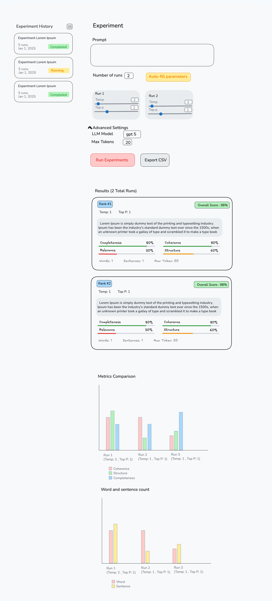
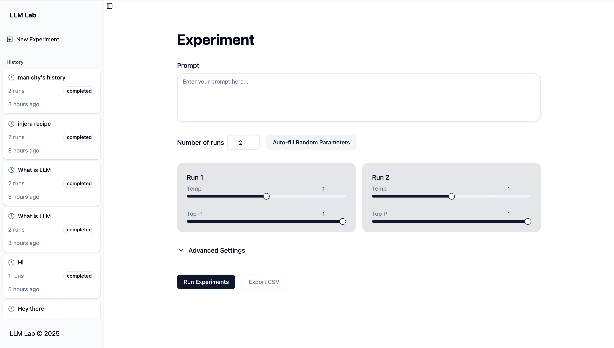
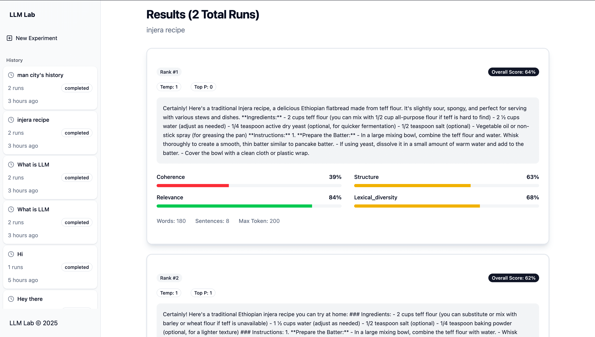
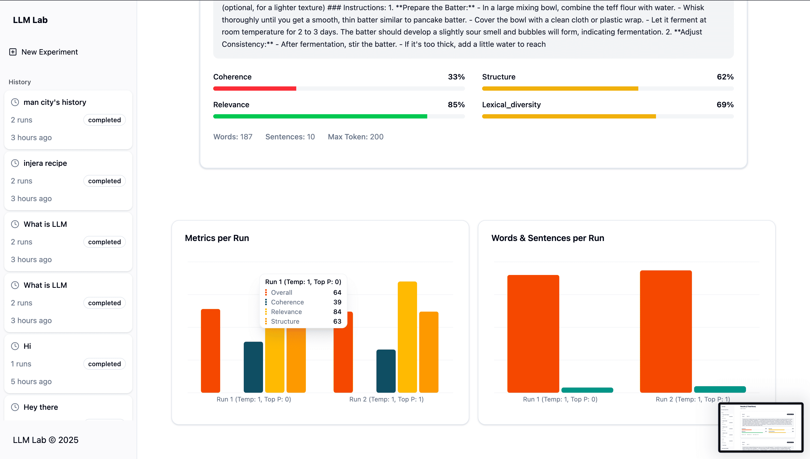

# LLM Lab

LLM Lab is a platform for running controlled experiments with Large Language Models (LLMs).

### Backend Documentation
See [backend README](backend/README.md) for backend details.

### Frontend Documentation
See [frontend README](frontend/README.md) for frontend details.

##  Project Board
Track the roadmap and tasks on the GitHub Project board:  [Project Board](https://github.com/users/gurmessa/projects/3)


## Quality Metrics Explanation

LLM Lab uses a comprehensive set of metrics to evaluate the quality of LLM responses. These metrics are implemented in the backend services and provide quantitative measures for different aspects of response quality:


### 1. Relevance Metric
- **Purpose**: Evaluates how relevant the response is to the original prompt
- **Methodology**: Computes cosine similarity between embeddings of the prompt and response
- **Formula**: Cosine similarity between prompt embedding and response embedding, normalized to 0-1 range
- **Limitations**: May not distinguish between directly relevant and tangentially related content


### 2. Coherence Metric
- **Purpose**: Measures how well sentences in a response flow together
- **Methodology**: Uses OpenAI embeddings to compute cosine similarity between consecutive sentences
- **Formula**: Average cosine similarity between adjacent sentence embeddings
- **Limitations**: May not capture deeper semantic coherence; doesn't account for logical consistency across non-adjacent sentences


### 3. Structural Metric
- **Purpose**: Assesses the structural quality of responses (organization, formatting)
- **Methodology**: Evaluates multiple structural aspects including:
  - Appropriate response length
  - Sentence variety (variation in sentence lengths)
  - Paragraph structure (proper paragraph breaks)
  - Structural markers (transitional words like "however", "moreover")
  - Proper capitalization
  - List enumeration (bullet points, numbered lists)
  - Conclusion indicators
- **Formula**: Composite score from 8 sub-scores, each contributing equally (0-1 scale)
- **Limitations**: May not capture all aspects of good structure, also has limitation on Markdown format

### 4. Lexical Diversity Metric
- **Purpose**: Measures the variety of vocabulary used in a response
- **Methodology**: Calculates the ratio of unique words to total words
- **Formula**: `unique_words / total_words`
- **Limitations**: Doesn't account for semantic similarity between words; may favor longer responses

### 5. Overall Metric
- **Purpose**: Aggregates individual metrics into a weighted composite score
- **Methodology**: Computes a weighted average of all selected metrics
- **Formula**: `Σ(score_i * weight_i) / Σ(weight_i)`
- **Current Implementation**: Equal weights for all metrics

## Architectural Approach and Key Decisions

### System Architecture
LLM Lab follows a client-server architecture with a Next.js frontend communicating with a FastAPI backend:

```
┌─────────────────┐    ┌──────────────────┐    ┌────────────────────┐
│   Frontend      │───▶│   FastAPI        │───▶│   SQLite Database  │
│   (Next.js)     │    │   Backend        │    │   (Data Storage)   │
└─────────────────┘    └──────────────────┘    └────────────────────┘
                                │
                                ▼
                     ┌────────────────────┐
                     │   OpenAI API       │
                     │   Integration      │
                     └────────────────────┘
                                │
                                ▼
                   ┌──────────────────────────┐
                   │   Metrics Calculation    │
                   │   (Coherence, Relevance, │
                   │    Structure, Diversity) │
                   └──────────────────────────┘
```

### Key Architectural Decisions

1. **Separation of Concerns**:
   - Backend handles data management, experiment orchestration, and metrics calculation
   - Frontend focuses on user interaction and visualization
   - Clear API contracts define communication between layers

2. **Data Flow**:
   - User creates experiment via frontend form
   - Frontend sends experiment configuration to backend API
   - Backend orchestrates LLM API calls based on configuration
   - Responses are evaluated using multiple metrics
   - Results are stored in database and returned to frontend
   - Frontend visualizes results with charts and comparisons

3. **API Endpoints**:
   - `POST /experiments/` - Create new experiment
   - `GET /experiments/` - List all experiments
   - `GET /experiments/{id}/` - Get detailed experiment results
   - `GET /experiments/{id}/export/csv/` - Export results as CSV

4. **Component Structure**:
   - Backend follows domain-driven design with services, models, and APIs organized by function
   - Frontend uses feature-based organization with shared components

## UI/UX Design Rationale

### User Experience Journey
1. **Experiment Creation**: Users define prompts and parameters for LLM experiments
2. **Experiment Execution**: System runs experiments with real-time progress tracking
3. **Results Analysis**: Users compare outputs and metrics through visualizations
4. **History Navigation**: Users can access previous experiments

### Design Decisions
- **Split View Interface**: Allows side-by-side comparison of different parameter configurations
- **Progress Tracking**: Real-time visualization of experiment execution status
- **Comprehensive Metrics Dashboard**: Multiple charts and scores for detailed analysis
- **Responsive Layout**: Works across desktop and mobile devices with collapsible sidebar


### Wireframe Reference
<details open>
  <summary>Experiment UI Wireframe</summary>
  
</details>

<details open>
  <summary>Screenshots</summary>
  <div style="display: flex; gap: 10px; flex-wrap: wrap;">
    
    
    
  </div>
</details>


## Deployment Choices

### Hosting Platform
- **Backend**: Deployed on Digital Ocean VPS for full control and customization
- **Frontend**: Deployed on Vercel for optimized Next.js performance and automatic deployments

### Infrastructure Components
- **Backend Services**:
  - FastAPI application running on Docker container
  - Nginx reverse proxy for SSL termination
  - SQLite database for data persistence
  - Let's Encrypt for SSL certificates

- **Frontend Services**:
  - Static site hosting on Vercel
  - Automatic CI/CD from GitHub repository

### Environment Configuration
- **Backend Environment Variables**:
  - `OPENAI_API_KEY` - Required for LLM and embedding services
  - Docker compose setup for container orchestration

- **Frontend Environment Variables**:
  - `NEXT_PUBLIC_API_URL` - Backend API endpoint

### URLs
- **Backend API**: https://llm-lab.gurmessa.dev/docs/
- **Frontend Application**: https://llm-lab-one.vercel.app/

## Assumptions Made

### Technical Assumptions
1. **LLM API**: Assumes availability of OpenAI API for both response generation and embedding services
2. **Text Processing**: Relies on NLTK for robust text tokenization and processing
3. **Data Persistence**: Uses SQLite for simplicity in development and small-scale deployments
4. **Authentication**: Currently no authentication system; assumes trusted user base
5. **Performance**: Assumes modest usage patterns suitable for single-server deployment

### Data Assumptions
1. **Response Format**: Expects LLM responses to be text-based without specific formatting requirements
2. **Prompt Structure**: Assumes prompts are self-contained without complex context dependencies
3. **Evaluation Scope**: Focuses on response quality rather than factual accuracy or bias detection
4. **Language**: Primarily designed for English text processing

### Design Assumptions
1. **User Technical Level**: Assumes users have basic understanding of LLM concepts
2. **Experiment Scope**: It’s built for tuning parameters, not for large-scale comparisons.
3. **Visualization Needs**: Charts and metrics provide sufficient analysis capabilities
4. **Export Requirements**: CSV export meets data sharing needs


### Improvements
- Run background tasks using Celery with WebSocket support
- Track users via authentication or by IP address (with README documentation)
- Set up CI/CD pipeline for automated testing and deployment
- Integrate additional embeddings, e.g., Sentence Transformers
- Make FastAPI async and use `asyncio` for concurrent metrics and tasks  
- Render Markdown on the frontend for better UI display
- Automatically generate experiment names using LLM
